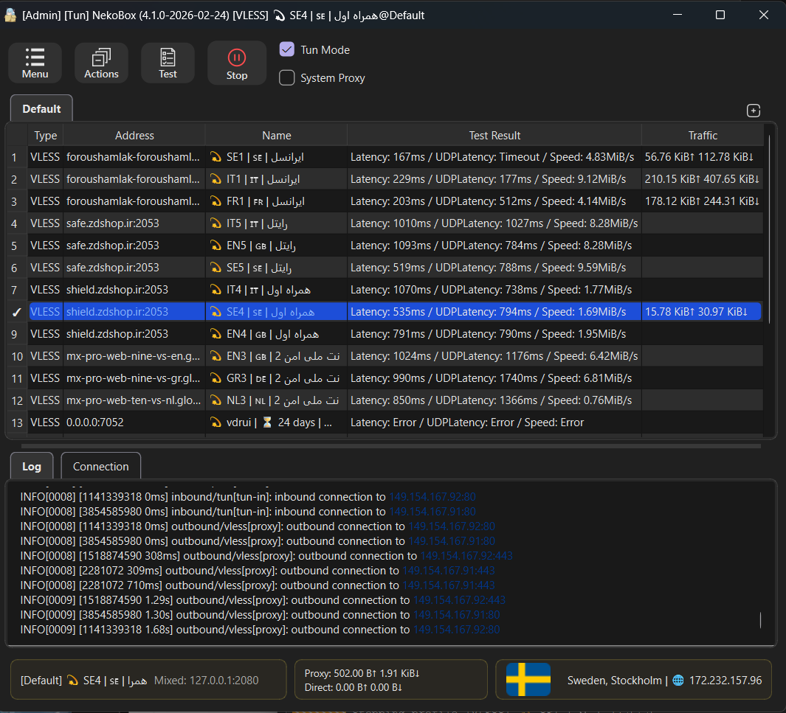
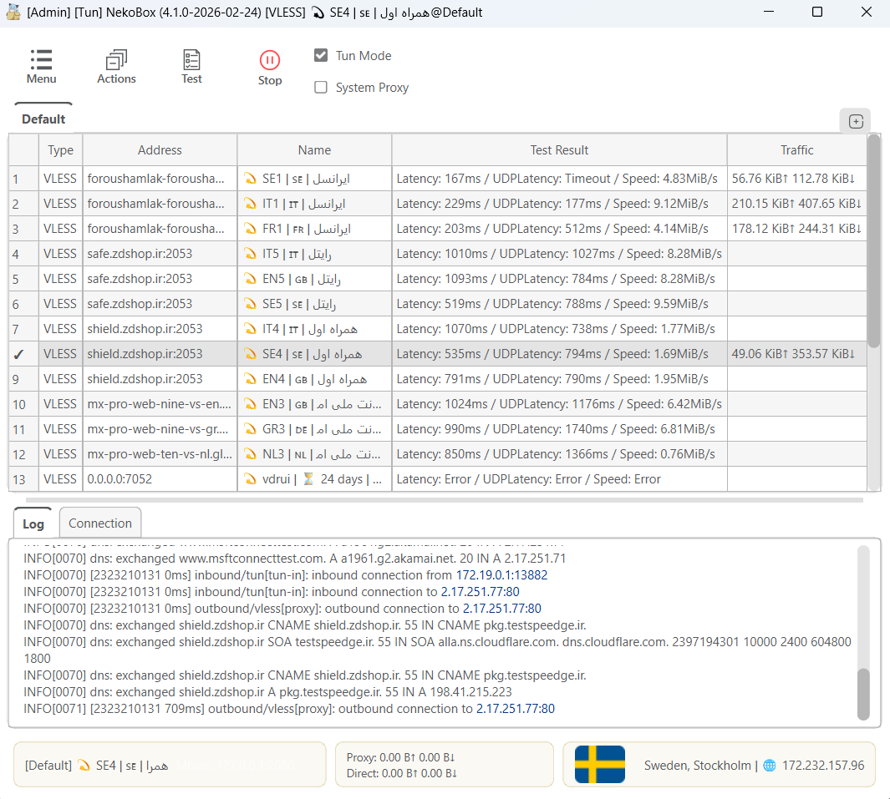

# 🌟 NekoBox (Nekoray) - UI Enhanced Edition

> **Note:** This is an independently enhanced fork of the original [MatsuriDayo/nekoray](https://github.com/MatsuriDayo/nekoray) project (which was archived on Mar 17, 2025). This repository brings modern UI refinements and quality-of-life (QoL) improvements to the stable v3.26 core.

A Qt-based cross-platform GUI proxy configuration manager (backend: sing-box). Currently supports **Windows / Linux** out of the box.

---

## ✨ What's New in this Modded Version?

This fork focuses on streamlining the user experience and modernizing the interface. Key improvements over the base v3.26 include:

- 🧹 **Decluttered Header:** Simplified the top layout for a cleaner, distraction-free configuration panel.
- ⚡ **Dedicated URL Test Button:** Added a prominent, interactive `Test` button with a sleek white icon in the main toolbar for lightning-fast latency checks.
- 🔄 **Smart Auto-Sorting:** The proxy list now automatically sorts itself by ping/latency immediately after a URL test finishes. 
- ➕ **Quick "Add Group" Actions:** Introduced a highly accessible `+` button directly next to the tab bar, making profile and group management much more intuitive.
- 🌍 **Enhanced Footer Data:** The bottom status bar now provides rich, dynamic information about your active out-bound connection, including **Exit IP, Country Name, and Country Flag**.
- 🛠️ **Actions Menu:** A new centralized dropdown menu for batch operations, including Regex-backed removal of unavailable nodes, duplicate filtering, and clearing test results.
- 🚀 **Next-Gen Core & App Engine:** Bumped version to `4.1.0`, integrating upstream core functionality while deprecating outdated legacy protocols like Hysteria 1. 
- 🎨 **Unified Design Language:** Completely fixed Qt's native rendering bugs (like disappearing borders in Windows Fusion style). Added responsive `:hover` and `:pressed` feedback loops to main buttons. The design looks exceptionally native and clean on both **Light** and **Dark** forms.

---

## 📥 Download & Installation

This is a portable application with no installer required. 

1. Go to the [Releases](../../releases) page.
2. Download the latest `nekoray-...-mod-release.zip` file.
3. Extract the folder to your preferred location.
4. Run [nekoray.exe](cci:7://file:///C:/Users/alish/Desktop/nekoray/nekoray-3.26-mod-release/nekoray.exe:0:0-0:0) to launch the client with the new interface.

> **Windows Users:** If you receive a "DLL missing" error upon execution, please download and install the [Microsoft Visual C++ Redistributable](https://learn.microsoft.com/en-us/cpp/windows/latest-supported-vc-redist).

---

## 🌐 Supported Protocols (Proxy)

- SOCKS (4/4a/5)
- HTTP(S)
- Shadowsocks
- VMess
- VLESS
- Trojan
- TUIC (via sing-box)
- NaïveProxy (Custom Core)
- Hysteria2 (Custom Core or sing-box)
- *Custom Outbound / Custom Config / Custom Core*

### Subscriptions
Raw support for widely used formats including Shadowsocks, Clash, and v2rayN.

---

## 🛠️ Credits & Acknowledgments

This project stands on the shoulders of giants. Massive thanks to the original developers and the open-source community:

**Gui & Maintenance:**
- [MatsuriDayo/nekoray](https://github.com/MatsuriDayo/nekoray) (Original Base Project)
- Qv2ray, Qt, protobuf, yaml-cpp, zxing-cpp, QHotkey, AppImageKit

**Core Engines:**
- `SagerNet/sing-box`
- `Matsuridayo/sing-box-extra`
- `XTLS/Xray-core`
- `v2fly/v2ray-core`
